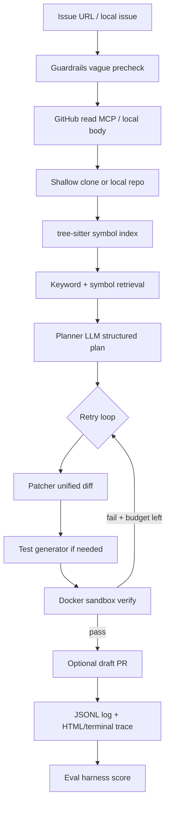

# AutoPatch

**Autonomous coding agent that turns a GitHub issue into a sandboxed, human-reviewed draft PR.**

Engineering teams accumulate small bugs faster than they can triage them. Closed coding agents are hard to inspect. AutoPatch is a lightweight, self-hostable alternative: ingest an issue, index the repo with tree-sitter, plan a fix, generate a unified diff plus tests, verify inside Docker with capped retries, and open a **draft** PR with plan, test results, and cost. Never auto-merges — a human always reviews.

> **Status:** Day 3 complete — eval harness, fixture set (local + real closed issues), honest metrics pipeline, polished docs.

## Non-goals (v1)

- Large multi-file architectural rewrites
- Auto-merging PRs
- Fine-tuning models (orchestration + retrieval + tool use only)
- Supporting every language (Python first; TypeScript is stretch)

## Architecture



Hand-rolled **plan → act → observe → retry** loop (no LangChain core). Tools are MCP servers (filesystem, sandbox, GitHub, codebase) used in-process by the agent.

See [ARCHITECTURE.md](ARCHITECTURE.md) for the module map and guardrail table.

## Demo

| Asset | Location |
|---|---|
| Walkthrough | [demo/walkthrough.md](demo/walkthrough.md) |
| Sample issue | [demo/sample_issue.md](demo/sample_issue.md) |
| Buggy target package | [demo/sample_target/](demo/sample_target/) |
| Day-2 terminal capture | [demo/screenshots/day2_terminal.png](demo/screenshots/day2_terminal.png) |
| Sample HTML trace | [demo/screenshots/day2_trace.html](demo/screenshots/day2_trace.html) |

Record a ~2-minute screencast from the walkthrough (index → run sample → trace → optional draft PR) and link it here when published.

## Quickstart

```bash
# Prerequisites: Python 3.11+, uv, Docker (for sandbox verify)
uv sync --all-extras
cp .env.example .env   # set ANTHROPIC_API_KEY (and GITHUB_TOKEN for real issues/PRs)

# Symbol index only
uv run autopatch index demo/sample_target

# Full loop on the included buggy sample (needs Docker + API key)
uv run autopatch run \
  --repo demo/sample_target \
  --title "Fix clamp() lower bound" \
  --issue-file demo/sample_issue.md \
  --html-trace

# Plan + patch without Docker
uv run autopatch run \
  --repo demo/sample_target \
  --title "Fix clamp() lower bound" \
  --issue-file demo/sample_issue.md \
  --skip-sandbox

# Real GitHub issue → draft PR
uv run autopatch run https://github.com/owner/repo/issues/123 --create-pr

# Human gate: promote draft to ready-for-review (never merges)
uv run autopatch pr ready https://github.com/owner/repo/pull/456

# Trace viewer
uv run autopatch trace .autopatch/logs/run-<id>.jsonl --html

# Eval harness
uv run autopatch eval --list
uv run python eval/run_eval.py --local-only
uv run python eval/run_eval.py --dry-run   # inventory only, no agent

docker compose up --build
```

## Eval results

The harness lives under [`eval/`](eval/): fixtures in `eval/issues/`, runner in `eval/run_eval.py`, outputs in `eval/results/`.

| Metric | Value |
|---|---|
| Fixture count | **23** (5 local smoke + 18 real closed GitHub issues) |
| Local targets with golden diffs | 4 (`clamp`, `is_even`, `percent`, `reverse_words`) |
| Live resolve rate | **pending** — run `uv run python eval/run_eval.py --local-only` with API key + Docker |
| Checked-in baseline | [eval/results/report.md](eval/results/report.md) (inventory, not inflated scores) |

**How scoring works**

| Signal | Definition |
|---|---|
| Resolved | Sandbox tests passed after agent patch (`--skip-sandbox`: patch produced) |
| Attempts | Retry loop length (1 + failures up to `MAX_RETRIES`) |
| Cost | Estimated USD from token logs |
| Time | Wall-clock seconds per fixture |
| Edit distance | `1 - similarity` vs golden unified diff when annotated (0 = identical) |
| Tests in patch | Whether the agent touched a test path |

Imperfect numbers are expected and preferred over marketing. See the report for **where it fails** and **what I'd do with more time**.

## Where it failed and what I learned

1. **Guardrails beat cleverness** — vague issues and runaway multi-file patches fail closed; that keeps draft PRs reviewable.
2. **Retrieval is not embeddings-first** — keyword + tree-sitter symbols are enough for small packages; large monorepos need better context budgets (stretch: embeddings).
3. **Sandbox truth** — host-side “it looks right” is insufficient; only Docker pytest results count as resolve.
4. **Eval honesty** — shipping an inventory + harness before a paid full run is better than inventing a resolve rate. Pin pre-fix commits next (SWE-bench style) to avoid false positives on already-fixed default branches.
5. **Human gate** — draft-only PRs force review; cost in the PR body makes autonomy economically visible.

## Project layout

Matches `AGENTS.md` / `PRD.md` §4:

```text
src/autopatch/
  agent/          # plan → act → observe → retry (+ test gen, guardrails)
  mcp_tools/      # filesystem, sandbox, GitHub, codebase (MCP)
  retrieval/      # tree-sitter symbol index
  sandbox/        # DockerRunner
  llm/            # LLMProvider (Claude default, OpenAI swap)
  tracing/        # structured JSON logs + cost + HTML/terminal viewer
eval/
  issues/         # fixture JSON (+ expected/*.diff goldens)
  targets/        # local buggy packages for offline scoring
  run_eval.py     # harness CLI
  results/        # results.json + report.md
demo/             # sample issue, target, walkthrough, screenshots
```

## Configuration

| Variable | Purpose |
|---|---|
| `ANTHROPIC_API_KEY` | Claude (default provider) |
| `OPENAI_API_KEY` | OpenAI swap path |
| `GITHUB_TOKEN` | Issue read / clone / draft PR / mark ready |
| `LLM_PROVIDER` | `claude` \| `openai` |
| `LLM_MODEL` | default `claude-sonnet-4-6` |
| `MAX_FILES_PER_PATCH` | safety cap (default 5) |
| `MAX_RETRIES` | sandbox failure retries after first attempt (default 3) |
| `SANDBOX_TIMEOUT_SECONDS` | container exec timeout |
| `RUN_TIMEOUT_SECONDS` | overall agent run timeout |

## Development

```bash
uv sync --all-extras
uv run ruff check .
uv run mypy src
uv run pytest
uv run python eval/run_eval.py --list
```

CI: GitHub Actions runs ruff, mypy, and pytest on every push/PR.

## License

MIT — see [LICENSE](LICENSE).
